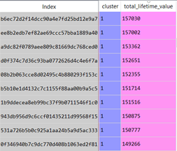
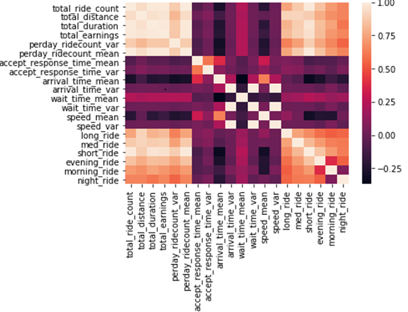
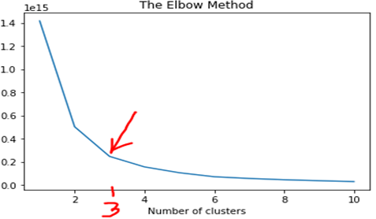
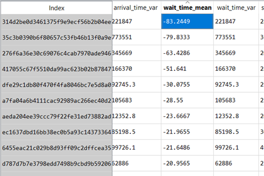
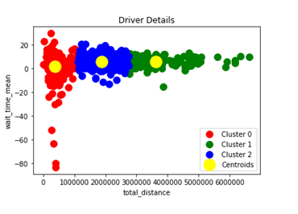
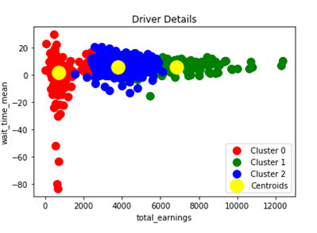
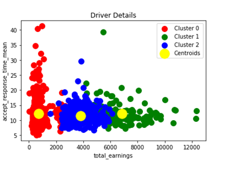
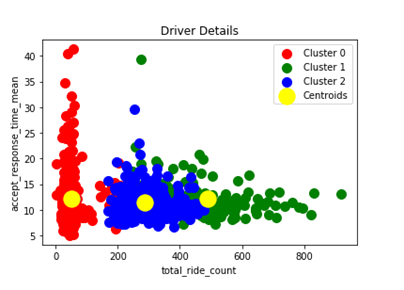
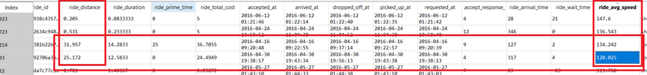
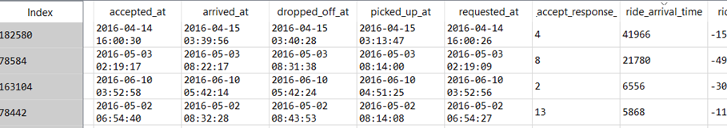

**Lyft Data Challenge**

The recommended Lifetime Values (in \$) of the top 10 drivers (along
with the driver id's) is shown in the table.

Index represents driver\_id

The steps we followed to arrive at our conclusion are as follows,

First, we calculated the cost per ride using the assumptions for the
Lyft rate card given. There are 4 components which decide the value of
the cost per ride: base fare, cost per mile, cost per minute & service
fee. The Prime-time fee updates the cost per ride, and considers the
base fare, cost per mile and cost per minute.

The formula thus obtained for calculating the cost per ride was

\- Cost per ride = (1 + ride\_prime\_time/100) \* {base\_fare +
\[cost\_per\_mile\*(ride\_distance\*0.000621)\] +
\[cost\_per\_minute\*(ride\_duration/60)\]} + service\_fee

\- Cost per ride = Min (400\$, Cost per ride)

\- Cost per ride = Max (5\$, Cost per ride)

We next did feature extraction to extract the key and deciding factors
that affect a driver's lifetime value. For each of the features, the
mean and variance of the features were considered. It is so because for
any feature, there will be instances where variance may give false
results (consistently performing bad, for example), and there will be
instances where mean may give false results (consider outliers for
example). These features, or the factors that affect a driver's lifetime
value are summarized below.

-   **RIDE ACCEPT RESPONSE TIME:** It is the time a driver takes to
    accept a ride once it is requested. If the accept response time is
    low or negligible, that means the driver is loyal to his/her job. If
    the driver takes more time consistently in accepting a ride once it
    is requested, that concludes that the driver is not interested in
    his/her job and is an early sign of resignation.

-   **RIDER ARRIVAL TIME:** It is the time a driver takes to reach the
    pickup location once a ride is accepted. Even though it is not a
    strong measure in determining the driver's lifetime value, but may
    result in the driver being tempted to leave the firm if that driver
    consistently gets rides with high arrival time, i.e., the pickup
    location is far away from the location where the driver accepted the
    ride. Or we can assume that the driver is willingly arriving late to
    pick up the rider. Both situations are negatively impacting the
    driver's lifetime value towards the firm.

-   **DRIVER WAIT TIME:** It is the time a driver waits for the rider
    once the driver reaches the pickup location. If a driver
    consistently gets rides with higher wait times, that may be a factor
    for him/her to leave the firm.

-   **RIDE AVERAGE SPEED:** It defines the average speed with which the
    driver has completed all the rides, depending on the total distance
    covered and total time taken to cover that distance. If the driver
    has an average speed over a certain threshold speed, it is an
    indication that either the driver will get highly penalized and
    might lose his/her job or the driver may (unfortunately) die, thus,
    highly reducing his/her projected lifetime.

-   **RIDE LENGTH:** The rides are divided into three broad categories:
    short rides (less than 8 km), medium rides (8-20 km), and long rides
    (more than 20 km). This indicates which type of rides, based on
    length a driver generally gets.

-   **RIDE TIME:** The rides are divided into three broad categories:
    morning (6 am -- 3 pm), evening (3 pm -- 9 pm) and night (9 pm -- 6
    am). It determines at what time of the day a driver generally does
    his job.

After getting all the features, we tried to find the correlation between
the extracted features, by plotting the correlation heat map. The heat
map is shown below.

It was observed that all the extracted features were important as there
was a low correlation among all the features (as shown by the darker
squares).

Next, we tried to cluster the drivers based on the extracted features.
For doing so, the first step was to calculate the number of clusters. We
used Elbow method to get the number of clusters.

From the Elbow method, it was concluded that we require 3 clusters to
classify our drivers. We would classify those 3 clusters as good,
mediocre and bad, indicating good drivers (the ones who will stay with
the firm for a longer time and are contributing heavily to the profit of
the firm), the mediocre drivers (not good as well as not bad) and the
bad drivers (the ones who are bound to leave the firm sooner and aren't
comparatively contributing that much to the firm).

Next, we applied K-Means clustering, to classify the drivers based on
the features and plotted various clustering scatter between two of the
features, to arrive at significant conclusions. Some key observations
are listed below.

The above observations compare the mean of the wait time of a driver
(the time a driver waits for the rider after arriving at the pickup
location) with different features, such as total distance covered by a
driver, total earnings by a driver and total rides done by a driver. It
was observed that the drivers who have a wait time closer to 0 (the good
drivers) are clustered in cluster 1 (shown in green), while the ones
with abnormal wait times (the bad drivers) are clustered in cluster 0
(shown in red). We can also observe from the table that we have negative
values of the wait time for the cases where the driver started a ride
even before arriving at the pickup location. This is not desirable and
should be totally avoided and such drivers must be penalized. Our
clustering correctly identifies those bad drivers.

Another observation was the accept response time of a driver (the time a
driver takes to accept a ride once requested by a rider), based on total
earnings and total rides done by a driver. It was observed that bad
drivers generally take more time to accept a ride while good drivers
generally accept a ride instantly.

It was also observed that there are some bad drivers who have done
rides, far exceeding the threshold limit, as shown in the above figure.
Consider for example, the drivers who drove 31.957 km at an average
speed of 134.242 km/h. These speeds are not desirable and such drivers
should be penalized.

Another observation was the outlier data in the dataset. All the
above-mentioned rides have a high ride arrival time, i.e., the driver
took a long time to arrive at the pickup location. There could be a
couple of reasons, either the driver selection algorithm is not that
great (which is highly unlikely), or the driver deliberately took long
time to pick the rider up (and thus decreasing the value of the firm in
the eyes of the customers). Such drivers are also bad drivers.

We also observed that there were **some drivers without any rides but
are associated with the firm** with an on-board date **(93 drivers in
total)**. These drivers are not considered for the model and are
classified as bad drivers.

In order to arrive at a recommended Driver's Lifetime Value (in
numerals, given the limited dataset), we have assumed that **the bad
drivers will likely stay with the firm for 1 year**, **the mediocre
drivers will stay for 3 years** while **the good ones will stay for 5
years**. Based on these assumptions, we used the driver's total earnings
to compute the 'Driver's Lifetime Value' for the good classified
clusters.

Actionable recommendations for business are:

-   Enhance the driver allotment algorithm such that a driver must
    travel the least distance to pickup a rider from the location where
    he/she accepted the ride. This will reduce the extra distance
    (arrival time) covered by the driver without an associated fare as
    well as save the time in covering more rides.

-   Aim to reduce the driver 'wait time'. This can be accomplished by
    charging the riders a fee if they take more time after the driver
    has arrived at the pickup location. This will not only help the firm
    with maintaining the trust of the driver with the firm but will also
    help the firm cover more rides in the same time, and hence,
    increasing the efficiency.

-   Increase the number of drivers during Prime time. This will help
    getting driver earn extra money and will also help the firm cover
    the fulfilments of all the riders in an area where there is a high
    demand for rides.

-   Implement strict penalizations for drivers exceeding the speed
    limit. Give one warning and if the driver defaults again, take
    appropriate actions against the driver. It would not only set a good
    image of the firm in the eyes of its customers and inculcate a good
    traffic sense among all but would also make the roads safer for all.